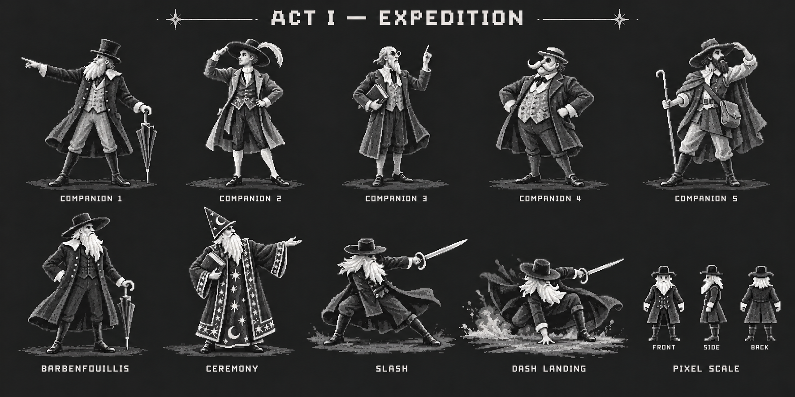
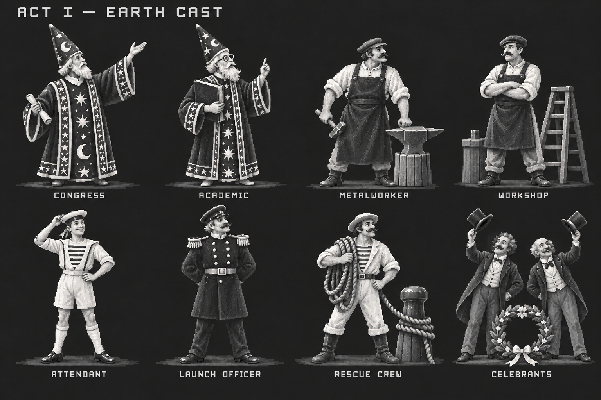
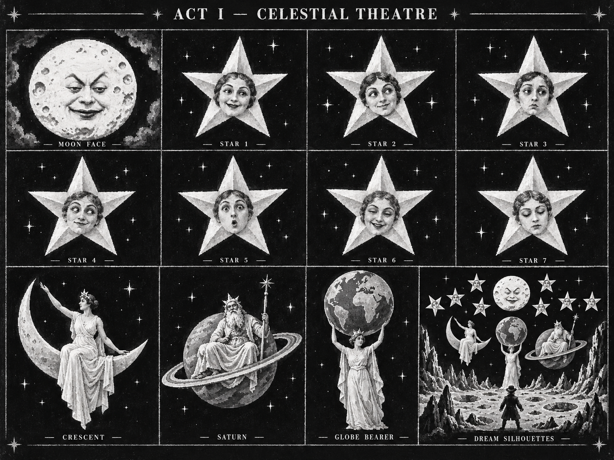
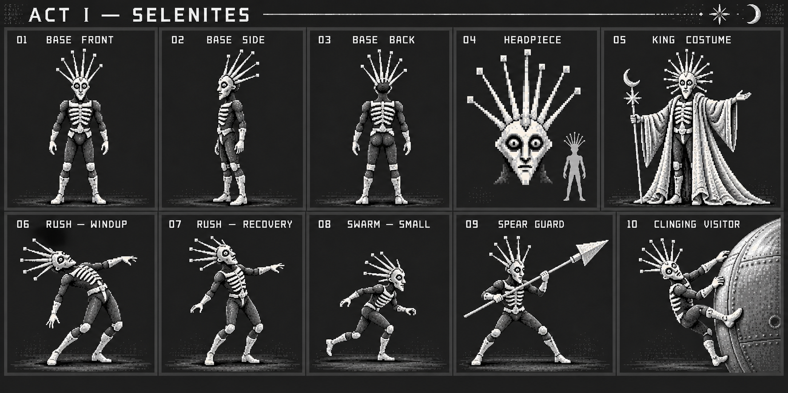

# Act 1 character concepts

Four new finished boards extend the existing lunar traveller, court and object studies into a full cast collection. All use the chosen moon-white, dusty-silver, charcoal and black game palette. They are contemporary concept art, with interpretable costumes and poses, rather than historical film objects or ready-to-use sprites.

| ID | Board | Coverage |
| --- | --- | --- |
| G07 | [Expedition cast and player](expedition-cast-and-player.png) | Barbenfouillis and five companion costume interpretations; separate ceremony variant; slash, dash landing and reduced pixel silhouette studies |
| G08 | [Earth supporting cast](earth-supporting-cast.png) | Academic congress, metalworkers, sailor launch attendants, launch officer, harbour rescue crew and celebrants |
| G09 | [Celestial performers](celestial-performers.png) | Human-faced Moon, seven individual star faces, crescent woman, Saturn-like performer, globe-bearer and dream silhouettes |
| G10 | [Selenite costumes and game roles](selenite-costumes-and-roles.png) | Film-linked biped costume family, headpiece, King, Rush, small Swarm, Spear Guard and clinging visitor |

G07 keeps coats, hats and beards in the expedition silhouette; the robe and pointed hat belong to the explicit ceremony study. Companion differences are proposed visual identities, not assertions about exact named film costumes. The umbrella-handled sword and action poses express the existing game proposal.

G08 makes the Earth cast welcoming and purposeful. They support the launch, rescue and celebration. Their costume families do not introduce human combat opponents.

G09 gathers celestial figures for art direction. Its combined vignette does not establish that seven stars and the planetary performers appear together in one original shot. Celestial figures are scenery or dream performers; separate boss studies define the Moon's game attacks.

G10 preserves upright, human-performing Selenites with pale rib bands and projecting headpieces. Rush, Swarm and Spear Guard are game roles and pose proposals. The smaller swarmer remains biped. These studies show silhouettes, not verified attack timing or collision bounds.

The [style guide](../../../reference-library/act1/STYLE_GUIDE.md) and [film database](../../../reference-library/act1/README.md) retain source provenance. The [generation manifest](../generated-manifest.json) records complete prompts, original reference paths, entity links, generation method and inspection notes.

