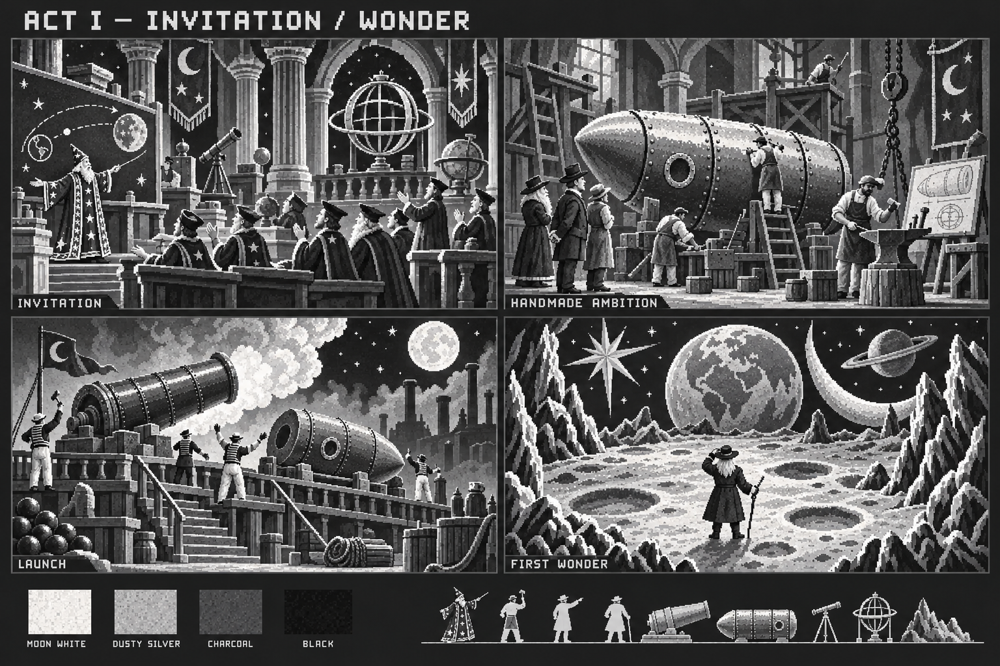
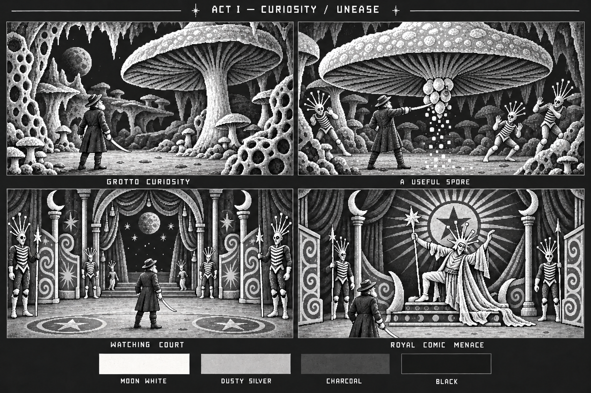
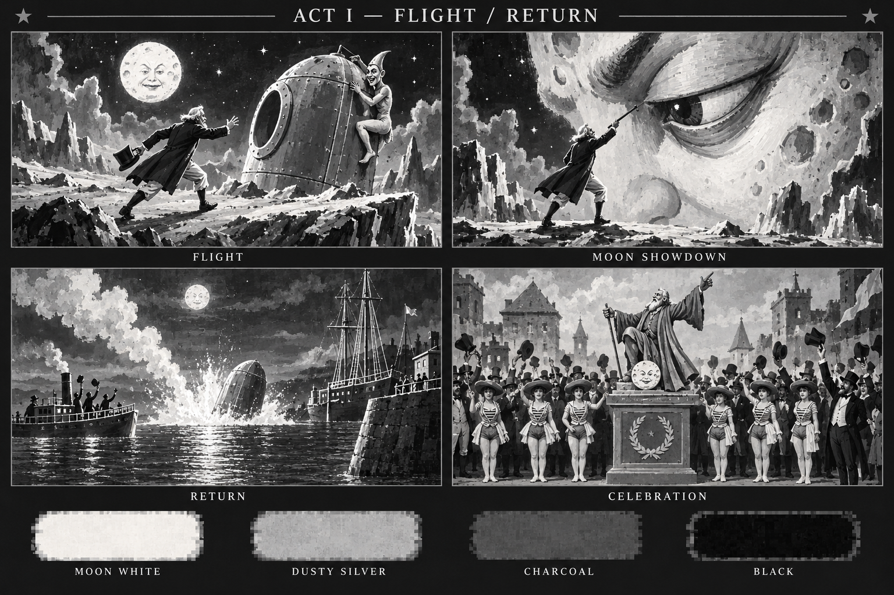

# Act 1 mood concepts

Three new boards trace the story from comic scientific ambition to lunar unease, then flight and relief. Each contains four cinematic panels and four grayscale value swatches. These are mood compositions; playable camera, slash reach, encounter timing and safe landings still require the dedicated game-view studies and greybox tests.

| ID | Board | Mood sequence |
| --- | --- | --- |
| G11 | [Invitation, launch and wonder](invitation-launch-and-wonder.png) | Welcome at the congress → handmade ambition → theatrical launch → quiet first wonder |
| G12 | [Grotto curiosity and royal menace](grotto-curiosity-and-royal-menace.png) | Discovery → a useful spore opening → being watched → comic royal authority |
| G13 | [Flight, showdown and return](flight-showdown-and-return.png) | Playful urgency → invented Moon-eye encounter → harbour relief → celebration |

G11 gives a new player time to feel welcome and to recognise the expedition's crafted equipment. Human workers and attendants remain friendly. The lunar stage introduces a strong traveller silhouette, broad calm ground and black sky between bright scenery.

G12 turns curiosity into manageable unease. Its revised spore panel shows a cluster lowered into ordinary close slash reach. Hitting the cluster makes sparse spores fall and living Selenites retreat harmlessly; no automatic damaging vent is depicted. The King's theatrical posture supports an approachable first boss.

G13 gives the Moon showdown a face-scale mood while the actual game encounter remains a compact local arena. Its cinematic gesture and scale are not a gameplay reach specification. The harbour return and celebration are reusable coda tableaux; Act 1 completion unlocks Act 2 and does not end the campaign.

The palette is the project's interpretation of the film imagery. It does not imply that monochrome was the film's only authentic print form. The [style guide](../../../reference-library/act1/STYLE_GUIDE.md) distinguishes original frames, restored colour material, later artwork and new game inventions. Full prompts and selected-revision history are in the [manifest](../generated-manifest.json).

