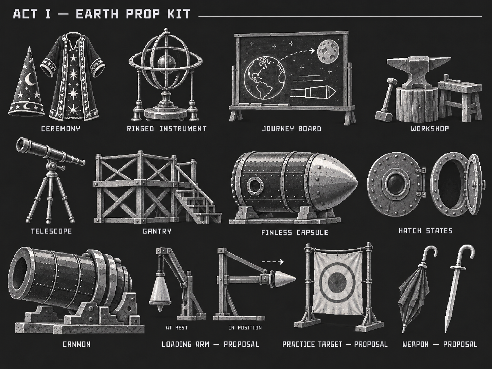
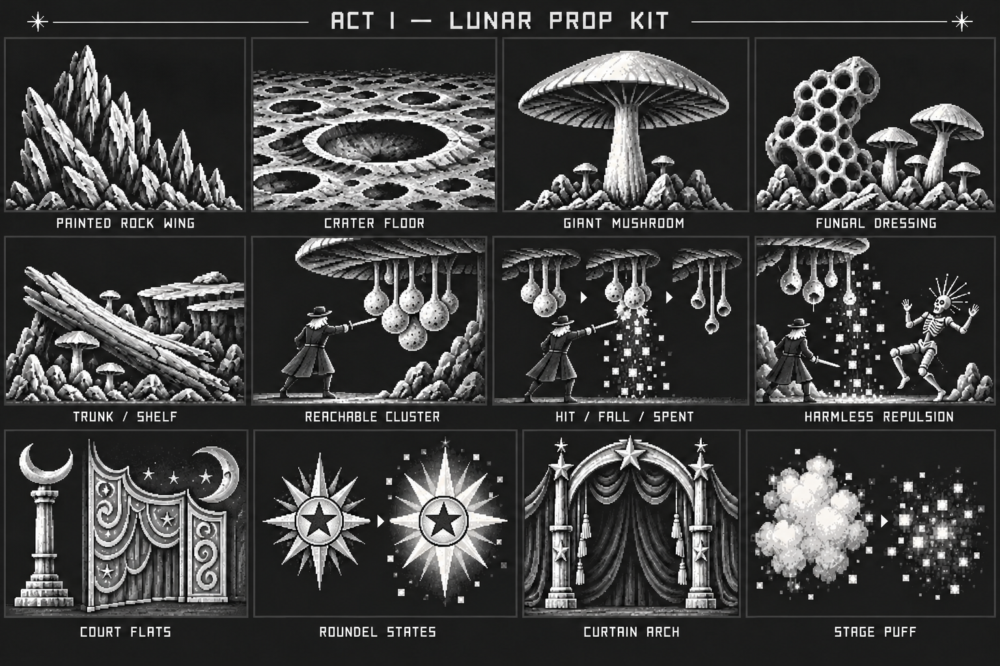

# Act 1 prop and scenery modules

Two new twelve-study boards expand the existing object sheets into reusable art kits. The capsule, rocks, fungi and court ornament support regular and optional levels through rearrangement and scene states. These are concept drawings, not implemented interactables or production-ready game assets.

| ID | Board | Coverage |
| --- | --- | --- |
| G14 | [Earth launch modular kit](earth-launch-modular-kit.png) | Ceremony costume, ringed instrument, blackboard, workshop tools, telescope, gantry, finless capsule, hatch states, cannon and labelled game tutorial/weapon proposals |
| G15 | [Lunar, grotto and court modular kit](lunar-grotto-and-court-modular-kit.png) | Painted rock wing, crater floor, mushrooms, fungal dressing, trunk/shelf, spore states/repulsion, court flats, star roundel, curtain and stage puff |

G14 reuses the film-linked squat finless bullet capsule for construction, launch, landing and escape. An open/closed hatch is a state study of the same prop. The loading arm, practice target and umbrella-handled short weapon are labelled contemporary proposals. The board does not authorise a wider switch, trap or puzzle system.

G15's selected revision lowers hanging spore pods into horizontal short-sword reach. The three interaction cells show a full cluster, player contact, falling spores, a visibly emptied cluster and a living Selenite moving away. Spores temporarily repel regular enemies harmlessly. They are not automatic vents, toxic damage zones or projectile mushrooms.

The radial ornament keeps the court's five-point-star center and proposes a brief brightening state. Jagged rock flats, crescent columns, curling scenic panels and curtains remain the shared theatrical kit. Optional areas should rearrange these modules and add only their small documented differences.

Film object IDs and game entity links are recorded in the [generation manifest](../generated-manifest.json). Consult the [reference library](../../../reference-library/act1/README.md) and [style guide](../../../reference-library/act1/STYLE_GUIDE.md) for observed source shapes and limits of historical attribution.

